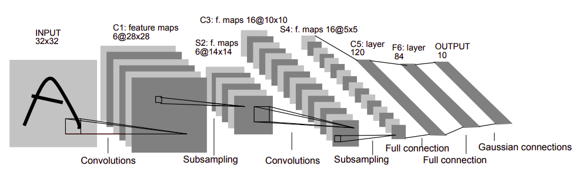

# LeNet-5 - The first step to CNN(s)
 

Convolutional Neural Networks are multi-layer neural networks that are trained using back-propagation. They are faster than normal perceptrons in recognizing visual patterns from images with minimal preprocessing. 

LeNet-5 was designed for handwritten and machine-printed character recognition by [Yann LeCun](http://yann.lecun.com/), [Leon Bottou](https://leon.bottou.org/start), [Yosuha Bengio](https://yoshuabengio.org/) and [Patrick Haffner](https://www.linkedin.com/in/patrick-haffner-bbb386/).
LeNet-5 is made up of 7 layers which include 3 convolutional layers, 2 subsampling layers, and 2 fully connected layers.
 

It was introduced in the research paper [Gradient-based Learning Applied to Document recognition](http://vision.stanford.edu/cs598_spring07/papers/Lecun98.pdf) in the year 1998. 

## 👏Getting Started
The repository will include training and testing code for LeNet-5 on three frameworks - TensorFlow, PyTorch, MXNet. The current training code supports MNIST dataset. 

#### 🧱Folder Structure
_model\_pytorch_: model definition for PyTorch 
_model\_tensorflow_: model definition for TensorFlow 
_model\_mxnet_: model definition for MXNet 
 
_train\_pytorch_: training code for PyTorch 
_train\_tensorflow_: training code for TensorFlow 
_train\_mxnet_: training code for MXNet 

#### 🛒Requirements
The requirements are arranged according to the framework in the **requirements** folder. There is one file for anaconda environments and another for python virtual environments.

#### 🚂Training a model (e.g, PyTorch model)
1. Go into the appropriate framework training folder.  
`cd train_pytorch`
2. There are several **command line arguments** defined in the train.py file. Please go through those before training. 
3. If using default arguments, you can start the training by (the dataset is automatically downloaded):  
`python train.py` 
4. The testing accuracy is printed after the training gets completed. The model is also saved as per the default parameters (if parameters are not provided while training).
  
Note - This assumes that you are in the virtual environment that contain all the dependencies.

## 🎓Results
#### PyTorch
| Pooling        | Activation           | Batch-size  | Accuracy |
| ------------- |:-------------:| :-----:| ------: |
| Max      | ReLU | 256 | 99.07% |
| Max      | LeakyReLU | 256 | 99% |
| Max      | TanH | 256 | 98.96% |
| Avg      | LeakyReLU | 256 | 98.92% |
| Avg      | ReLU | 256 | 98% |
| Avg      | TanH | 256 | 97.96% |

## 📝TODO
1. TensorFlow and MXNet training code.
2. Better visualizations of the dataset and training.
3. Training on custom datasets.
4. Inference scripts for images/videos.
5. Jupyter notebooks for training and inference. 

## 📚References
1. [PyTorch](https://pytorch.org/)
2. [Getting Started with Anaconda](https://docs.anaconda.com/anaconda/user-guide/getting-started/)
3. [Getting Started with Python Virtual Environments](https://realpython.com/python-virtual-environments-a-primer/)
4. [Gradient-based Learning Applied to Document recognition](http://vision.stanford.edu/cs598_spring07/papers/Lecun98.pdf)
5. [LeNet-5](http://yann.lecun.com/exdb/lenet/) 
